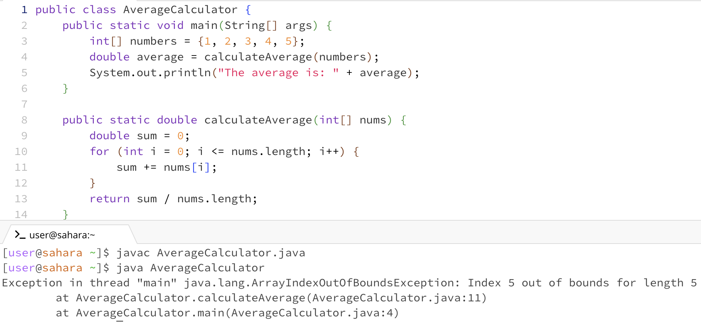

# Lab Report 5 - Putting it All Together
## 1. The original post
- screenshot showing a symptom
   
- description of a guess at the bug
Hey guys, ran into this `ArrayIndexOutOfBoundsException` and it's kinda throwing me off. It's saying something about trying to access index 5 in an array that's only supposed to go up to 4? The error points to where it happened, but I'm honestly not sure what's causing this. Could it be something to do with how I set up the loop to end, or did I miss a small but crucial detail somewhere? Feels like I've overlooked something basic about array indexes or just made a rookie mistake handling the array. Any thoughts? 

