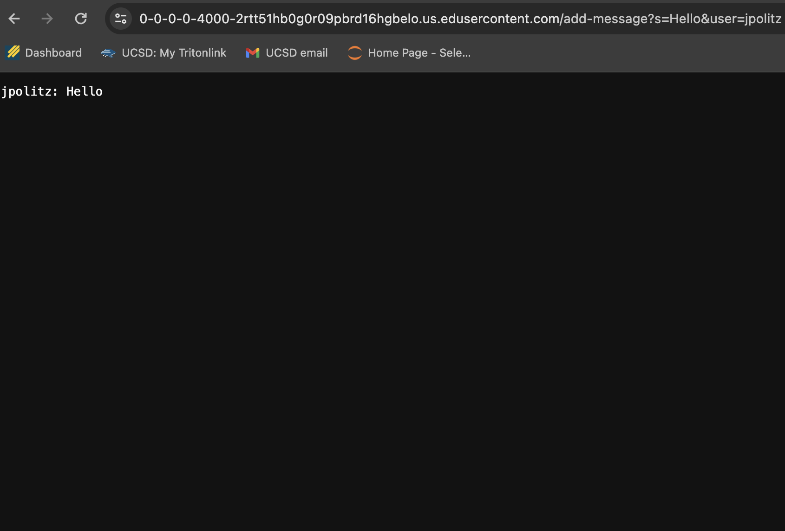
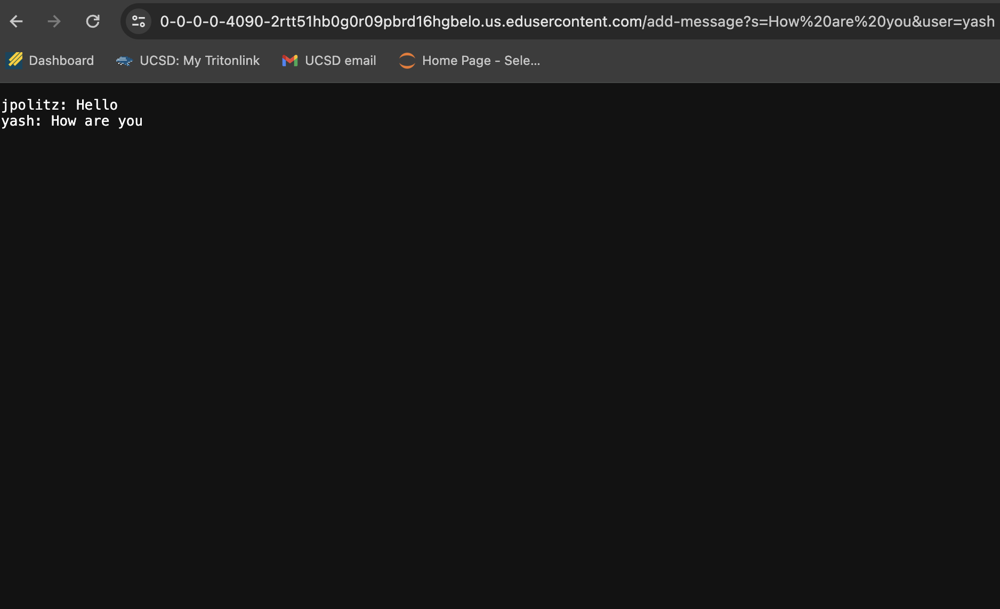

## Lab report 2 
# Part 1: Chat Server 
**Code for the ChatServer**
```
import java.io.IOException;
import java.net.URI;

class Handler implements URLHandler {
    // The one bit of state on the server: a number that will be manipulated by
    // various requests.
    private String chatHistory = "";

    public String handleRequest(URI url) {
        if ("/add-message".equals(url.getPath())) {
            String query = url.getQuery();
            String[] queryParams = query.split("&");
            String user = null;
            String message = null;

            for (String param : queryParams) {
                String[] keyValue = param.split("=");
                if ("user".equals(keyValue[0]) && keyValue.length > 1) {
                    user = keyValue[1];
                } else if ("s".equals(keyValue[0]) && keyValue.length > 1) {
                    message = keyValue[1];
                }
            }

            if (user != null && message != null) {
                chatHistory += user + ": " + message + "\n";
                return chatHistory;
            } else {
                return "Invalid parameters!";
            }
        } else {
            return "404 Not Found";
        }
    }
}

class ChatServer {
    public static void main(String[] args) throws IOException {
        if(args.length == 0){
            System.out.println("Missing port number! Try any number between 1024 to 49151");
            return;
        }

        int port = Integer.parseInt(args[0]);

        Server.start(port, new Handler());
    }
}
```
**Screenshots of using `/add-message`:**<br />
`/add-message?s=Hello&user=jpolitz`
<br />
`/add-message?s=How are you&user=yash`
<br />


