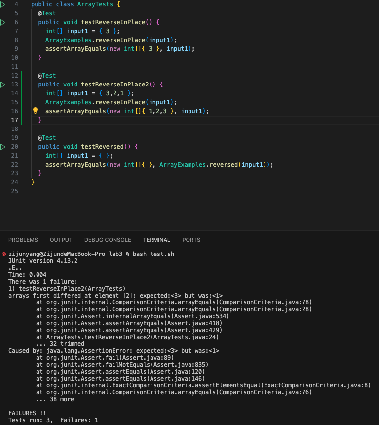

## Part 1 - Bugs
1. A failure-inducing input for the buggy program, as a JUnit test and any associated code (write it as a code block in Markdown)
- JUnit Test:
  ```
	@Test 
	public void testReverseInPlace() {
    	int[] input1 = { 3, 2, 1 };
    	ArrayExamples.reverseInPlace(input1);
    	assertArrayEquals(new int[]{1, 2, 3 }, input1);
	}
- Associated Code:
  ```
    static void reverseInPlace(int[] arr) {
    for(int i = 0; i < arr.length; i += 1) {
      arr[i] = arr[arr.length - i - 1];
    }
  }
2.  An input that doesn't induce a failure, as a JUnit test and any associated code (write it as a code block in Markdown)
- JUnit Test:
  ```
	@Test 
	public void testReverseInPlace() {
    int[] input1 = { 3 };
    ArrayExamples.reverseInPlace(input1);
    assertArrayEquals(new int[]{ 3 }, input1);
	}
  
- Associated Code:
  ```
  static void reverseInPlace(int[] arr) {
    for(int i = 0; i < arr.length; i += 1) {
      arr[i] = arr[arr.length - i - 1];
    }
  }
3.  The symptom, as the output of running the tests (provide it as a screenshot of running JUnit with at least the two inputs above)
4. The bug, as the before-and-after code change required to fix it (as two code blocks in Markdown)
   - before code
     ```
     static void reverseInPlace(int[] arr) {
    	for(int i = 0; i < arr.length; i += 1) {
      arr[i] = arr[arr.length - i - 1];
     }
     }
   - after code
     ```
     static void reverseInPlace(int[] arr) {
    	for(int i = 0; i < arr.length / 2; i++) {
        int temp = arr[i];
        arr[i] = arr[arr.length - i - 1];
        arr[arr.length - i - 1] = temp;
   	 }
     }
# Briefly describe why the fix addresses the issue：
The previous code fails because it overwrites elements of the array before swapping them, resulting in the loss of original values. By only iterating through half of the array and using a temporary variable to hold the value of elements during the swap, the issue is resolved, ensuring a correct reversal of the array.<br>

## Part 2 - Researching Commands
1. `-type`
- Example 1:
```
% find . -type f
./technical/911report/chapter-13.2.txt
./technical/911report/chapter-13.3.txt
./technical/911report/chapter-3.txt
./technical/911report/chapter-2.txt
./technical/911report/chapter-1.txt
./technical/911report/chapter-5.txt
./technical/911report/chapter-6.txt
./technical/911report/chapter-7.txt
./technical/911report/chapter-9.txt
./technical/911report/chapter-8.txt
./technical/911report/preface.txt
./technical/911report/chapter-12.txt
./technical/911report/chapter-10.txt
```
At this point, `-type f` is help find command to find all the files in the current directory.
   - Example 2:
```
% find . -type d
.
./lib
./.git
./.git/objects
./.git/objects/pack
./.git/objects/info
./.git/info
./.git/logs
./.git/logs/refs
./.git/logs/refs/heads
./.git/logs/refs/remotes
./.git/logs/refs/remotes/origin
./.git/logs/refs/remotes/upstream
./.git/hooks
./.git/refs
./.git/refs/heads
./.git/refs/tags
./.git/refs/remotes
./.git/refs/remotes/origin
./.git/refs/remotes/upstream
./.git/branches
./technical
./technical/government
./technical/government/About_LSC
./technical/government/Env_Prot_Agen
./technical/government/Alcohol_Problems
./technical/government/Gen_Account_Office
./technical/government/Post_Rate_Comm
./technical/government/Media
./technical/plos
./technical/biomed
./technical/911report
```
For `-type d` is to find all the directory in the current directory.<br>
2. `-mtime`
   - Example 1:
```
% find . -mtime -3 -type f
./technical/911report/chapter-2.txt
./technical/911report/chapter-1.txt
./technical/911report/chapter-5.txt
./technical/911report/chapter-6.txt
./technical/911report/chapter-7.txt
./technical/911report/chapter-9.txt
./technical/911report/chapter-8.txt
./technical/911report/preface.txt
./technical/911report/chapter-12.txt
```
`-mtime -3` here is to help `find` to collect all the files that been modified in last 3 days in the current directory.
   - Example 2:
```
% find . -mtime -3 -type d
.
./lib
./.git
./.git/objects
./.git/objects/pack
./.git/objects/info
./.git/info
./.git/logs
./.git/logs/refs
./.git/logs/refs/heads
./.git/logs/refs/remotes
./.git/logs/refs/remotes/origin
./.git/logs/refs/remotes/upstream
./.git/hooks
./.git/refs
./.git/refs/heads
./.git/refs/tags
./.git/refs/remotes
./.git/refs/remotes/origin
./.git/refs/remotes/upstream
./.git/branches
./technical
./technical/government
./technical/government/About_LSC
./technical/government/Env_Prot_Agen
./technical/government/Alcohol_Problems
./technical/government/Gen_Account_Office
./technical/government/Post_Rate_Comm
./technical/government/Media
./technical/plos
./technical/biomed
./technical/911report
```
`-mtime -3` here is to help `find` to collect all the directory that been modified in last 3 days in the current directory.<br>
3. `-size`
   - Example 1:
```
% find . -size +10M -type f
./.git/objects/pack/pack-f3e64844a2bd252cbb7d4b547cb60beb349fd441.pack
```
`-size` here is to help `find` to collect all the files that larger than 10 megabytes in the current directory.
   - Example 2:
```
% find . -size +1k -type d
./technical/government/Gen_Account_Office
./technical/government/Media
./technical/plos
./technical/biomed
```
`-size` here is to help `find` to collect all the directory that bigger than 1 kilobytes in the current directory.<br>

4. `-empty`
- Example 1:
```
% find . -type f -empty
./find-results.txt
./grep-results.txt
```
`-empty` here is to help `find` to collect all the empty files in the current directory.
   - Example 2:
```
% find . -type d -empty 
./.git/objects/info
./.git/refs/tags
./.git/branches
```
`-empty` here is to help `find` to collect all the empty directory in the current directory.

# Sources used:
1. https://www.redhat.com/sysadmin/linux-find-command
2. Chatgpt
> What I ask Chatgpt
> What does find do in command line, and what does - type , -mtime, -size, -empty work for find command<br>
> Answers:
> The find command in the command line is a powerful utility available on Unix-like operating systems (such as Linux and macOS) used for searching the filesystem to find files and directories that meet certain criteria. It can search through one or more directories and evaluates an expression containing various tests, actions, and logical operators to find files or directories that match the specified conditions.

>Here's how the options -type, -mtime, -size, and -empty work with the find command:

>-type: This option is used to specify the type of files to be searched. It filters the search results based on the type of file. Commonly used types include:

>f for regular files
>d for directories
>l for symbolic links
>Example: find . -type f finds all regular files in the current directory and its subdirectories.
-mtime: This option is used to find files based on their modification time. It is specified in days. For example, -mtime -1 finds files modified in the last 24 hours, while +1 would find files modified more than 24 hours ago. The time is calculated as 24-hour periods from the current moment.
Example: find . -mtime -7 finds files that were modified in the last 7 days.

>-size: This option is used to find files of a specific size. It can be used to search for files larger or smaller than a given size, with units such as c (bytes), k (kilobytes), M (megabytes), and G (gigabytes).
Example: find . -size +10M finds files larger than 10 megabytes.

>-empty: This option finds empty files and directories. It's useful for cleaning up a filesystem or identifying unused files or directories.
Example: find . -empty finds all empty files and directories in the current directory and its subdirectories.

>These options can be combined to form powerful search queries. For example, to find all empty directories in the current directory, you could use find . -type d -empty. The find command's versatility makes it an essential tool for filesystem management and navigation in Unix-like operating systems.


      
   


