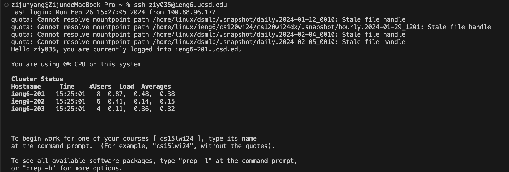
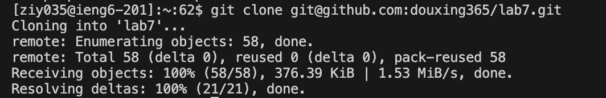
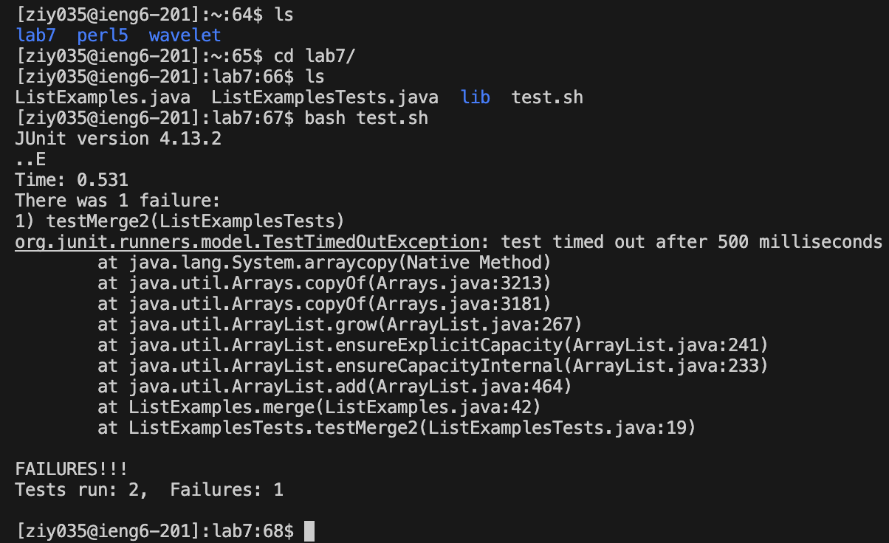
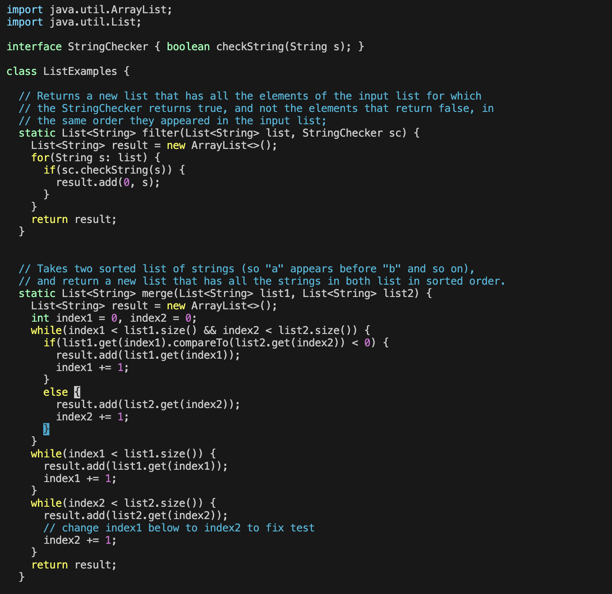
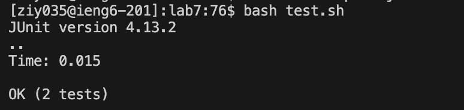
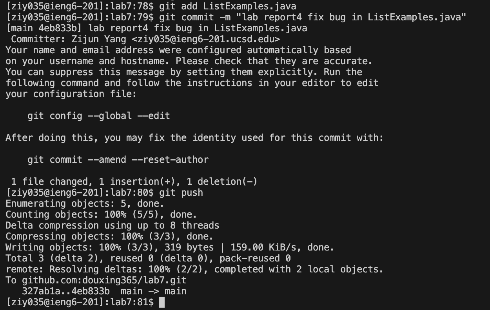

# Lab Report 4 - Vim (Week 7)
## Step 4 Log into ieng6

## Step 5 Clone your fork of the repository from your Github account (using the SSH URL)

## Step 6 Run the tests, demonstrating that they fail

## Step 7 Edit the code file to fix the failing test

## Step 8 Run the tests, demonstrating that they now succeed

## Step 9 Commit and push the resulting change to your Github account (you can pick any commit message!)

